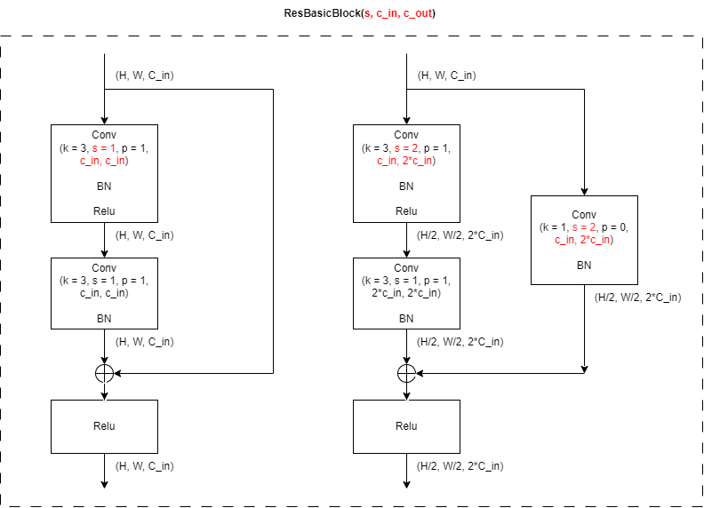
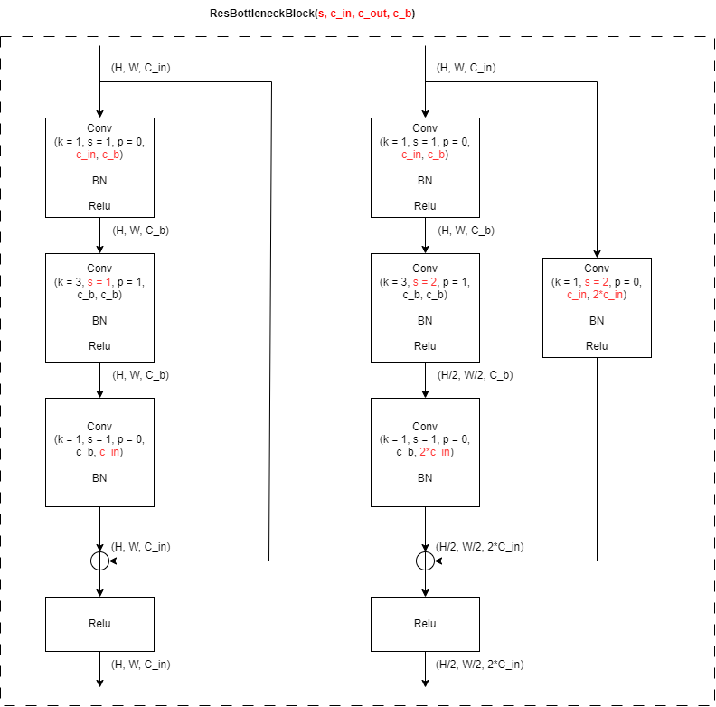
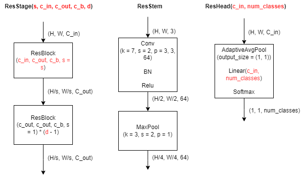
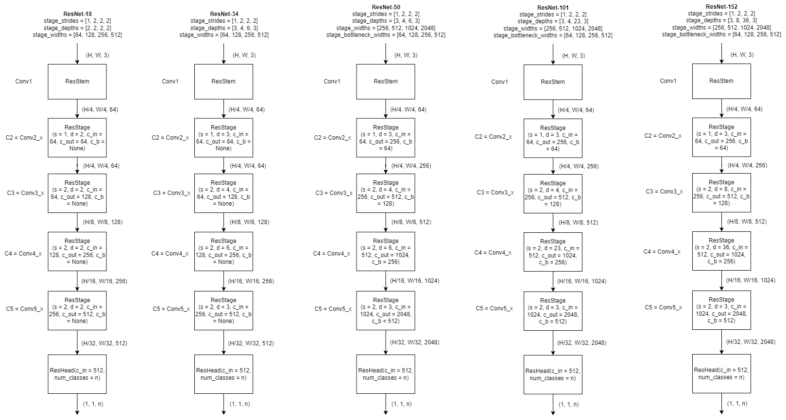

# Reference

**Title**: Deep Residual Learning for Image Recognition

**Research Team**: Microsoft Research

**Publish Date**: Dec 10, 2015

# Abstract

* Present a residual learning framework to ease the training of deep neural network. The residual networks are easier to optimize, and can gain accuracy from considerably increased depth.

* Reformulate the layers as learning residual functions with reference to the layer inputs, instead of learning unreferenced functions.

# ResNet Architecture

## ResNet-18/34 building block

Figure 1. ResNet-18/34 building block architecture. **Left**: a block with feature map size and the number of channels unchanged. **Right**: a block with feature map size halved and the number of channels doubled.

## ResNet-50/101/152 building block

Figure 1. ResNet-50/101/152 building block architecture. **Left**: a block with feature map size and the number of channels unchanged. **Right**: a block with feature map size halved and the number of channels doubled.

## ResStage, ResStem, ResHead

## ResNet

