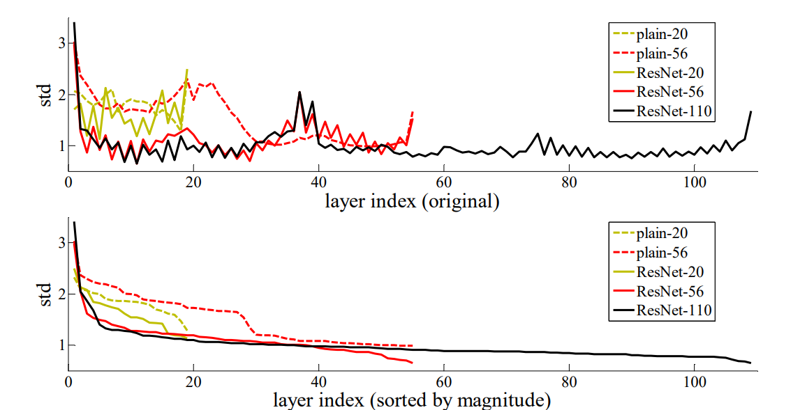

# Reference

**Title**: Deep Residual Learning for Image Recognition

**Research Team**: Microsoft Research

**Publish Date**: Dec 10, 2015

# Abstract

* Present a residual learning framework to ease the training of deep neural network. The residual networks are easier to optimize, and can gain accuracy from considerably increased depth.

* Reformulate the layers as learning residual functions with reference to the layer inputs, instead of learning unreferenced functions.

# Introduction

* The network depth is of crutial importance to promote performances.
  
* Learning better networks is not as easy as stacking more layers because of 2 arised problems:

  * **Vanishing/exploding gradients**: This has been largely addressed by normalized initialization and intermediate batch normalization layers.

  * **Degradation**: With the network depth increasing, accuracy gets saturated and then degrades rapidly. Such degradation is not caused by overfitting, since adding more layers leads to higher training error, as shown in Figure 1.

* Degradation indicates that not all systems are similarly easy to optimize. 

  * Consider a shallower architecture and its deeper counterpart that adds more layers onto it. There exists a solution by construction to the deeper model: the added layers are identidy mapping, and the other layers are copied from the learned shallower model. This constructed solution should produce no higher training error than its shallower counterpart. However, Figure 1 shows that our current solvers on hand are unable to find solutions that are comparably good or better than the constructed solution.

* The authors' team addresses the degradation problem by introducing a deep residual framework. 

  * The framework's structure is shown in Figure 2. This framework explicitly let stacked layers fit a residual mapping. More precisely, denoting the desired underlying mapping as $H(x)$, the authors let the stacked layers fit the mapping of $F(x):=H(x)-x$. 

* Based on comprehensive experiments, the research team show that

  * The deep residual nets are easier to optimize than the original, unreferenced "plain" nets. That is, the deep residual nets exhibit lower training error than the counterpart "plain" nets.

  * The deep residual nets can easily gain accuracy improvements from greatly increased depth.

 

 Figure 1. Training error (left) and test error (right) on CIFAR-10 with 20-layer and 56-layer "plain" networks. The 56-layer network actually has even higher training and test error. 

 

Figure 2. The deep residual framework.

# Related Work

* **Residual Representations**: Some existing residual representations suggest that a good reformulation or preconditioning can simplify the optimization. These methods include VLAD, Fisher Vector, Multigrid method, hierarchical basis preconditioning. 

* **Short Cinnections**: Concurrent with ResNet, "highway networks" present short connections with gating functions. It has 3 drawbacks compared with ResNet:

  * The gates are data-dependent and have parameters, while ResNet's identity mapping is parameter-free.

  * The gated shortcut may "close" (approaching zero), while ResNet's identity shortcut is never closed.

  * Highway networks have not demonstrated accuracy gains with extremely increased depth.

# Residual Learning

The reseatch team argue that the residual function $F(x):=H(x)-x$ is easier to be optimized than the underlying original function $H(x)$. This argument supported by Figure 3, on which we can see that the residual function in general have small response stds, suggesting that identity mapings provide reasonable preconditioning.

Figure 3. Standard deviation (std) of layer responses on CIFAR-10. The responses are the outputs of each 3x3 layer, after BN and before nonlinearlity. <b>Top:</b> the layers are shown in their original order. <b>Bottom:</b> the responses are ranked in descending order.

# ResNet Architecture

The research team introduces 5 members for the ResNet family, which are ResNet-18, 34, 50, 101, and 152. The members share a stem and head architecture, but use different building blocks in stages. The architectures of blocks, stages, stem, head, and the entire ResNet networks are illustrated below.

## ResNet-18/34 Building Block

A building block of ResNet-18/34 is composed of two 3x3 convolutional layers and follow two design rules:

* For the same output feature map size, the layers have the same number of filters and a stride of 1. The identity shortcut is used directly is this case.

* If the feature map size is halved, the layers have number of filters doubled and a stride of 2. A projection shortcut done by 1x1 convolutions is used to match dimensions.

Figure 4. ResNet-18/34 building block architecture. <b>Left:</b> a block with feature map size and the number of channels unchanged. <b>Right:</b> a block with feature map size halved and the number of channels doubled.

## ResNet-50/101/152 Building Block

For ResNet-50/101/152, their building blocks present a bottleneck transformation, which is done by 1x1, 3x3, and 1x1 convolutions. The 1x1 layers are responsible for reducing and then increasing dimensions, leaving the 3x3 layer a bottleneck with smaller input/output dimensions.

Except the internal bottleneck transformation, the building block as a whole processes feature maps in the same way as the one of ResNet-18/34. That is, the output feature maps' dimensions are either unchanged, or have height/width halved and channel number doubled. In the former case, a 1x1 convolution layer is also applied on the shortcut connection to match output feature dimensions.

Figure 5. ResNet-50/101/152 building block architecture. <b>Left</b>: a block with feature map size and the number of channels unchanged. <b>Right</b>: a block with feature map size halved and the number of channels doubled.

## ResStage, ResStem, ResHead

To begin with, ResStem is where input images are initially processed. It is composed of a 7x7 convolutional layer and a max pooling layer. Both of them have strides of 2 and the convolutional layer has 64 number of filters, which leads to an output of size (H/4, W/4, 64).

ResStem is followed by several ResStages, which is the core part of ResNet network that residual mappings are applied on. A ResStage is formed by stacking $d$ building blocks, where the 1st block performs feature downsampling if necessary, and the remaining ones maintain a constant feature size. The detailed settings for ResNet-18/34/50/101/152, including the values of $d$s, strides, input and output channel numbers, are listed in Figure 6.

Figure 5. The architectures of ResStage <b>(left)</b>, ResStem <b>(middle)</b>, and ResHead <b>(right)</b>.

## ResNet

