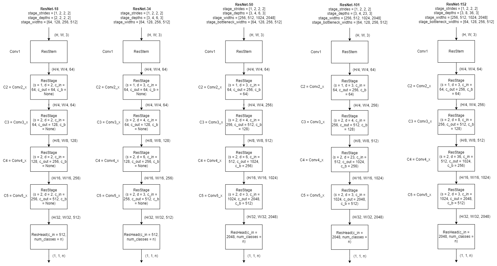

# Reference

**Title**: Deep Residual Learning for Image Recognition

**Research Team**: Microsoft Research

**Publish Date**: Dec 10, 2015

# Abstract

* Present a residual learning framework to ease the training of deep neural network. The residual networks are easier to optimize, and can gain accuracy from considerably increased depth.

* Reformulate the layers as learning residual functions with reference to the layer inputs, instead of learning unreferenced functions.

# Introduction

* The network depth is of crutial importance to promote performances.
  
* Learning better networks is not as easy as stacking more layers because of 2 arised problems:

  * **Vanishing/exploding gradients**: This has been largely addressed by normalized initialization and intermediate batch normalization layers.

  * **Degradation**: With the network depth increasing, accuracy gets saturated and then degrades rapidly. Such degradation is not caused by overfitting, since adding more layers leads to higher training error, as shown in Figure 1.

* Degradation indicates that not all systems are similarly easy to optimize. 

  * Consider a shallower architecture and its deeper counterpart that adds more layers onto it. There exists a solution by construction to the deeper model: the added layers are identidy mapping, and the other layers are copied from the learned shallower model. This constructed solution should produce no higher training error than its shallower counterpart. However, Figure 1 shows that our current solvers on hand are unable to find solutions that are comparably good or better than the constructed solution.

* The authors' team addresses the degradation problem by introducing a deep residual framework. 

  * The framework's structure is shown in Figure 2. This framework explicitly let stacked layers fit a residual mapping. More precisely, denoting the desired underlying mapping as $H(x)$, the authors let the stacked layers fit the mapping of $F(x):=H(x)-x$. 

* Based on comprehensive experiments, the research team show that

  * The deep residual nets are easier to optimize than the original, unreferenced "plain" nets. That is, the deep residual nets exhibit lower training error than the counterpart "plain" nets.

  * The deep residual nets can easily gain accuracy improvements from greatly increased depth.

 

 Figure 1. Training error (left) and test error (right) on CIFAR-10 with 20-layer and 56-layer "plain" networks. The 56-layer network actually has even higher training and test error. 

 

Figure 2. The deep residual framework.

# Related Work

* **Residual Representations**: Some existing residual representations suggest that a good reformulation or preconditioning can simplify the optimization. These methods include VLAD, Fisher Vector, Multigrid method, hierarchical basis preconditioning. 

* **Short Cinnections**: Concurrent with ResNet, "highway networks" present short connections with gating functions. It has 3 drawbacks compared with ResNet:

  * The gates are data-dependent and have parameters, while ResNet's identity mapping is parameter-free.

  * The gated shortcut may "close" (approaching zero), while ResNet's identity shortcut is never closed.

  * Highway networks have not demonstrated accuracy gains with extremely increased depth.

# ResNet Architecture

## ResNet-18/34 building block

Figure 1. ResNet-18/34 building block architecture. **Left**: a block with feature map size and the number of channels unchanged. **Right**: a block with feature map size halved and the number of channels doubled.

## ResNet-50/101/152 building block

Figure 1. ResNet-50/101/152 building block architecture. **Left**: a block with feature map size and the number of channels unchanged. **Right**: a block with feature map size halved and the number of channels doubled.

## ResStage, ResStem, ResHead

## ResNet

