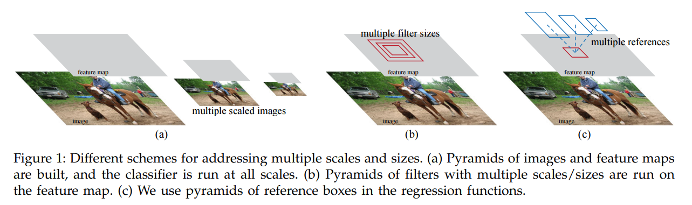
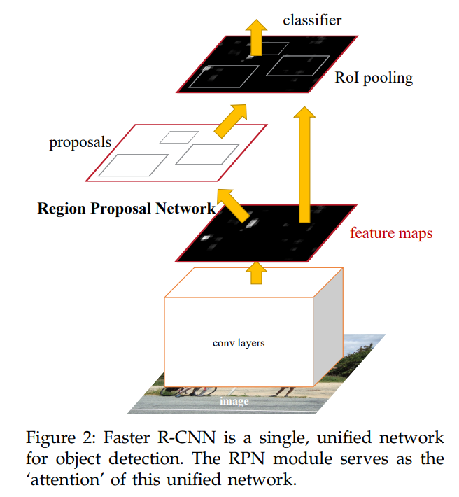
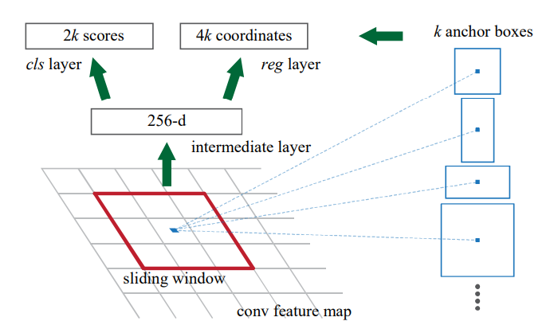

# Paper Info

**Title**: Faster R-CNN: Towards Real-Time Object Detection with Region Proposal Networks

**Published Date**: June, 2015

# Introduction

For the Fast R-CNN algorithm, region proposal generation is the time computation bottleneck in detection systems.

The research team introduces the Region Proposal Network (RPN) that share convolutional layers with object detection networks FPN and Fast-RCNN. This novel network leads to only a small marginal cost for computing proposals at test-time (10ms per image).

The team's observation is that the convolutional feature maps used by region-based detectors, like Fast-RCNN, can also be used for generating region proposals.

The RPN is constructed by adding a few conv layers that simultaneously regress region bounds and objectness scores at each location on a regular grid. The RPN thus can be trained end-to-end specifically for the task for generating detection proposals.

Compared with prevalent methods that uses pyramids of images (Figure 1a) or pyramids of filters (Figure 1b), FPN uses pyramids of reference boxes (anchors) in the regression functions. Under this design, PRNs are supposed to effectively predict region proposals with a wide range of scales and aspect ratios.

# Related Work

## Object proposals

Object proposal methods were adopted as external modules independent of the detectors. Widely used object proposals include Selective Search, CPMC, etc.

## Deep networks for object-detection

The R-CNN method trains CNNs end-to-end to classify the proposal regions into object categories or background. It mainly plays as a classifier, it does not predict object bounds except for refining by bounding box regression. Thus, its accuracy depends on the performance of the region proposal module.

Several papers have proposed ways of using deep networks for predicting object bounding boxes, such as OverFeat, MultiBox, etc.

Shared computation of convs has been attracting increasing attention for efficient and accurate visual recognition tasks. Adaptively-sized pooling (SPP) on shared conv features is developed for efficient region-based object detection and semantic segmentation.

# Faster R-CNN

Faster R-CNN is composed of 2 modules:

* RPN module: A deep fully conv network that propose regions. It serves as the "attention" that tells the Fast R-CNN module where to look.

* Fast R-CNN module: This module uses the proposed region.

## RPN

A RPN takes an image of any size as input and outputs a set of rectangular object proposals, each with an objectness score. 

To generate region proposals, the team makes a $n \times n$ sliding window from conv layers and slide it over the conv feature map output by a backbone. In the paper, the team use $n = 3$, and use Zeiler and Fergus model (ZF) and the Simonyan and Zisserman model (VGG-16) as the backbone.

The sliding window is mapped to a lower-dimentional feature (256-d for ZF and 512-d for VGG-16, with ReLU following). This feature is fed into 2 sibling $1 \times 1$ conv layers --- a box-regression layer (reg) and a box-classification layer (cls).

Figure 3: Region Proposal Network (RPN).

### Anchors

At each sliding window location, the RPN predicts $k$ proposals. So the reg layer has $4k$ outputs and the cls layer outputs $2k$ scores. The $k$ proposals are parameterized relative to $k$ reference boxes or anchors. 

An anchor is centered at the sliding window in question, and is associated with a scale and aspect ratio. The team uses 3 scales and 3 aspect ratios, yielding $k=9$ anchors at each sliding position. So for a conv feature map of a size $W \times H$, there are $WHk$ anchors in total.

 

**Translation invariant anchors**

An important property of this approach is that it is translation invariant, both in terms of the anchors and the functions that compute proposals relative to the anchors.  

If one translates an object in an image the proposal should translate and the same function should be able to predict the proposal in either location. 

In contrast, the MultiBox method is not translation invariant.

 

**Multi-scale anchors as regression reference**

The design of RPN presents a novel scheme for addressing multiple scales and aspect ratios. 

As show in Figure 1, the 1st way is based on image/feature pyramids, which is often usful but time-consuming. 

The second way is to use sliding window of multiple scales and or aspect ratios on the feature maps. This way is usually adopted jointly with the 1st way.

As a comparision, the way of RPN does is built on a pyramid of anchors, which is more cost-effective.

### Loss function

