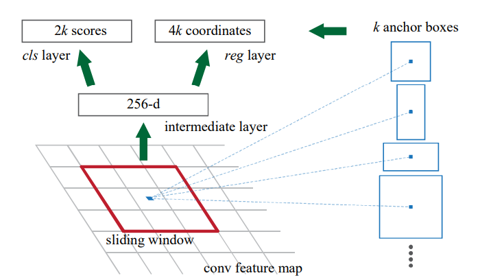
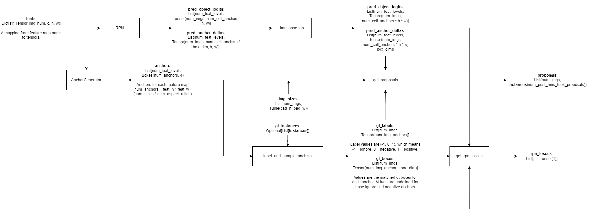
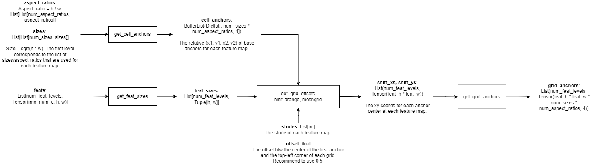
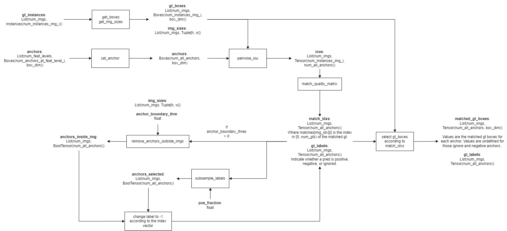
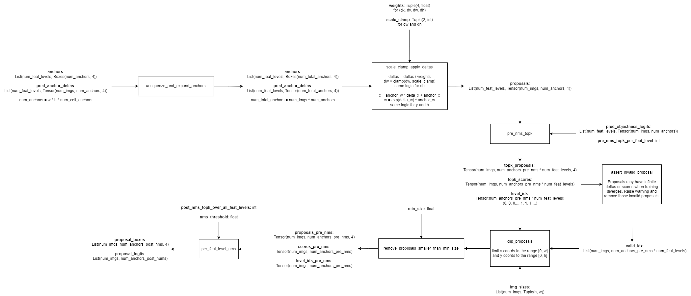
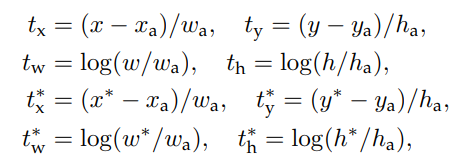

# Paper Info

**Title**: Faster R-CNN: Towards Real-Time Object Detection with Region Proposal Networks

**Published Date**: June, 2015

# Introduction

For the Fast R-CNN algorithm, region proposal generation is the time computation bottleneck in detection systems.

The research team introduces the Region Proposal Network (RPN) that share convolutional layers with object detection networks FPN and Fast-RCNN. This novel network leads to only a small marginal cost for computing proposals at test-time (10ms per image).

The team's observation is that the convolutional feature maps used by region-based detectors, like Fast-RCNN, can also be used for generating region proposals.

The RPN is constructed by adding a few conv layers that simultaneously regress region bounds and objectness scores at each location on a regular grid. The RPN thus can be trained end-to-end specifically for the task for generating detection proposals.

Compared with prevalent methods that uses pyramids of images (Figure 1a) or pyramids of filters (Figure 1b), FPN uses pyramids of reference boxes (anchors) in the regression functions. Under this design, PRNs are supposed to effectively predict region proposals with a wide range of scales and aspect ratios.

# Related Work

## Object proposals

Object proposal methods were adopted as external modules independent of the detectors. Widely used object proposals include Selective Search, CPMC, etc.

## Deep networks for object-detection

The R-CNN method trains CNNs end-to-end to classify the proposal regions into object categories or background. It mainly plays as a classifier, it does not predict object bounds except for refining by bounding box regression. Thus, its accuracy depends on the performance of the region proposal module.

Several papers have proposed ways of using deep networks for predicting object bounding boxes, such as OverFeat, MultiBox, etc.

Shared computation of convs has been attracting increasing attention for efficient and accurate visual recognition tasks. Adaptively-sized pooling (SPP) on shared conv features is developed for efficient region-based object detection and semantic segmentation.

# Faster R-CNN

Faster R-CNN is composed of 2 modules:

* RPN module: A deep fully conv network that propose regions. It serves as the "attention" that tells the Fast R-CNN module where to look.

* Fast R-CNN module: This module uses the proposed region.

## RPN

A RPN takes an image of any size as input and outputs a set of rectangular object proposals, each with an objectness score. 

To generate region proposals, the team makes a $n \times n$ sliding window from conv layers and slide it over the conv feature map output by a backbone. In the paper, the team use $n = 3$, and use Zeiler and Fergus model (ZF) and the Simonyan and Zisserman model (VGG-16) as the backbone.

The sliding window is mapped to a lower-dimentional feature (256-d for ZF and 512-d for VGG-16, with ReLU following). This feature is fed into 2 sibling $1 \times 1$ conv layers --- a box-regression layer (reg) and a box-classification layer (cls).

Figure 3a: Region Proposal Network (RPN).

 

The following flowchart illustrates how the RPN module works:

Figure 3b: RPN Flowchart.

### Anchors

At each sliding window location, the RPN predicts $k$ proposals. So the reg layer has $4k$ outputs and the cls layer outputs $2k$ scores. The $k$ proposals are parameterized relative to $k$ reference boxes or anchors. 

An anchor is centered at the sliding window in question, and is associated with a scale and aspect ratio. The team uses 3 scales and 3 aspect ratios, yielding $k=9$ anchors at each sliding position. So for a conv feature map of a size $W \times H$, there are $WHk$ (typically ~2400) anchors in total.

The following flowchart illustrates how the anchor generator works:

Figure 4a: The anchor generator.

 

**Translation invariant anchors**

An important property of this approach is that it is translation invariant, both in terms of the anchors and the functions that compute proposals relative to the anchors.  

If one translates an object in an image the proposal should translate and the same function should be able to predict the proposal in either location. 

In contrast, the MultiBox method is not translation invariant.

 

**Multi-scale anchors as regression reference**

The design of RPN presents a novel scheme for addressing multiple scales and aspect ratios. 

As show in Figure 1, the 1st way is based on image/feature pyramids, which is often usful but time-consuming. 

The second way is to use sliding window of multiple scales and or aspect ratios on the feature maps. This way is usually adopted jointly with the 1st way.

As a comparision, the way of RPN does is built on a pyramid of anchors, which is more cost-effective.

 

**Positive & negative anchors**

For training RPNs, the team assign a binary class label (foreground vs background) to each anchor. 

The team assign a positive label to 2 kinds of anchors:

* anchor / anchors with the highest IoU overlap with a ground-truth box.

* an anchor that has an IoU overlap higher than 0.7 with any ground-truth box.

The team assign a negative label to a non-positive anchor if IoU ratio is lower than 0.3 for all ground-truth boxes.

Anchors that are neither positive nor negative do not contribute to the training objective.

The following flowchart illustrates how the anchors are labelled and sampled:

Figure 4b: Label and sample anchors.

**Predict proposals from anchors**

The following flowchart illustrates the process of predicting proposals from anchors.

Figure 4c: Predict proposals from anchors.

### Loss function

The loss function for an image is defined as:

Figure 4: RPN loss function.

Here, $i$ is the index of an anchor in a mini-batch.

$p_i$ is the predicted probability of anchor $i$ being an object. The ground-truth label $p^*_i$ is 1 if the anchor is positive, and is 0 if the anchor is negative.

$t_i$ is a vector representing the 4 parameterized coordinates of the predicted bounding box, and $t^*_i$ is that of the ground-box associated with a positive anchor.

The classification loss is log loss over 2 classes.

The regression loss $L_{reg}(t_i, t^*_i)$ is the smooth $L_1$ loss. The term $p^*L_{reg}$ means the regression loss is activated only for positive anchors ($p^*$ = 1) and is disabled otherwise ($p_i^*$ = 0).

The two terms are normalized by $N_{cls}$ and $N_{reg}$ and weighted by a balancing parameter $\lambda$. In the paper, the team uses $N_{cls} = 256$ (the mini-batch size), $N_{reg} = 2400$ (the number of anchor locations), and $\lambda = 10$ (thus both cls and reg terms are roughly equally weighted).

The team show by experiments that the results are insensitive to the values of $\lambda$ in a wide range. 

The team adopt the parameterizations of the 4 bounding box coordinates following:

Figure 5: The parameterizations of the 4 coordinates for bounding box regression.

$x, y, w, h$ denote the box's center coordinates and its width and height.

Variables $x, x_a, x_*$ are for the predicted box, anchor box, and ground-truth box respectively (likewise for $y, w, h$).

*In this formulation, the features used for regression are of the same spatial size (3 × 3) on the feature maps. To account for varying sizes, a set of k bounding-box regressors are learned. Each regressor is responsible for one scale and one aspect ratio, and the k regressors do not share weights. As such, it is still possible to predict boxes of various sizes even though the features are of a fixed size/scale, thanks to the design of anchors.*

### Training RPNs

The team follow the *"image-centric"* sampling strategy from the Fast R-CNN paper to train the network. 

Each mini-batch arises from a single image that contains many positive and negative example anchors. Optimize for the loss of all these anchors will bias towards negative samples as they are dominate.

Therefore, the team randomly sample 256 anchors in an image to compute the loss, where the sampled positive and negative anchors have a ratio of up to 1:1. If there are fewer than 128 positive samples in an image, we pad the mini-batch with negative ones.

The team initializes all new layers by drawing weights from a zero-mean Gaussian distribution with standard deviation 0.01. All other layers (ie. the backbone) are initialized by pretraining a model for ImageNet classification, as is standard practice.

The team tune all layers of the ZF net, and conv3_1 and up for the VGG net to conserve memory.

The team use a learning rate of 0.001 for 60k mini-batches, and 0.0001 for the next 20k mini-batches on the PASCAL VOC dataset. The team use a momentum of 0.9 and a weight decay of 0.0005.

## Sharing features for RPN and Fast R-CNN

The previous section describes how to train a network for region proposal generation, without considering the region-based object detection CNN that will utilize these proposals.

This section describes algorithms that learn a unified network composed of RPN and Fast
R-CNN with shared a shared backbone.

The team discuss 3 ways for training networks with features shared:

 

**Alternating training**:

In this solution, we first train RPN, and use the proposals to train Fast R-CNN. The network tuned by Fast R-CNN is then used to initialize RPN, and this process is iterated. This is the solution that is used in all experiments in this paper.

 

**Approximate joint training**:

In this solution, the RPN and Fast R-CNN are merged into one network during training. In each SGD iteration, the forward pass generates region proposals which are treated just like fixed, pre-computed proposals when training a Fast R-CNN detector. The backward propogation takes place as usual, where for the shared layers the backward propogated signals from both the RPN and loss and the Fast R-CNN loss are combined. 

This solution is easy to implement. However, *it ignores the derivative w.r.t the proposal boxes' coordinates that are also network responses (and the roi_pooling is not differentiable w.r.t proposals)*, so is approximate.

In experiments, the team have empirically found this solver produces close results, yet reduces the training time by 25~50% comparing with alternating training. 